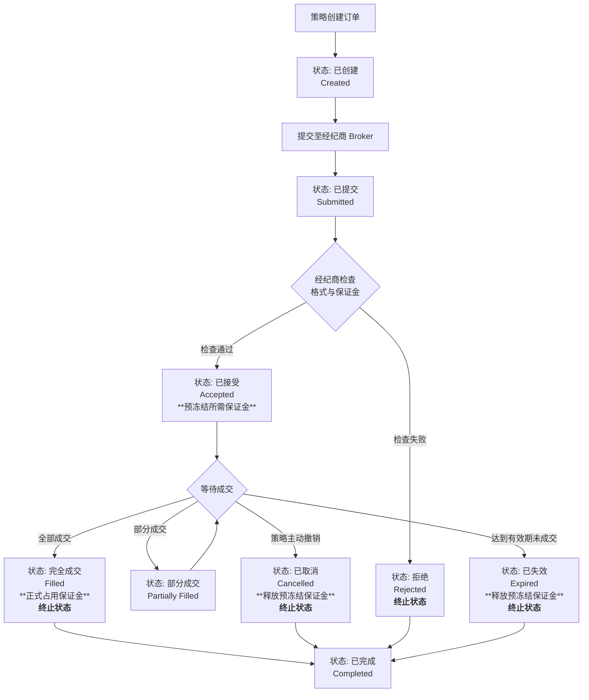

Q:我正在开发一个量化回测系统，我现在需要知道我提交订单给代理商，会有几个状态

A:在你开发量化回测系统时，理解订单从提交到最终完结的各个状态非常重要。这关系到策略逻辑的准确执行和资金、持仓的正确计算。通常情况下，一个订单会经历一系列的状态变迁。

下面这张状态流程图直观地展示了订单可能经历的主要状态及其典型变迁路径：

```mermaid
flowchart TD
    A[订单创建 (Created)] --> B[已提交 (Submitted)]
    B --> C[已接受 (Accepted)]
    C --> D[部分成交 (Partially Filled)]
    D --> E[完全成交 (Filled)]
    C --> E
    C --> F[已取消 (Cancelled)]
    D --> F
    C --> G[拒绝 (Rejected)]
    A --> G
    E --> H[已完成 (Completed)]
    F --> H
```

了解了整体流程后，我们来看看每个状态的具体含义和需要注意的地方：

| 状态                 | 含义                                                                 | 需要注意                                                                                             |
| :------------------- | :------------------------------------------------------------------- | :--------------------------------------------------------------------------------------------------- |
| **已创建 (Created)**   | 订单对象已在系统中生成，但可能还未正式发出。                           | 回测中此状态可能很短或不存在。                                                                             |
| **已提交 (Submitted)** | 订单已提交给模拟经纪人（Broker）。                                    | 意味着回测系统已接收并开始处理该订单。                                                                       |
| **已接受 (Accepted)**  | 订单已通过初步检查（如资金是否足够），进入排队等待执行或正在执行。           | 并非所有回测系统都显式有此状态。                                                                             |
| **部分成交 (Partially Filled)** | 订单中的**一部分**数量已经成交。                                       | 需记录已成交数和未成交数。**剩余部分可能继续等待成交，也可能被撤销**。                                             |
| **完全成交 (Filled)**  | 订单的**全部**数量已经成交。                                           | **这是订单成功执行的最终状态之一**。需记录成交价格、数量、时间及手续费。                                          |
| **已取消 (Cancelled)** | 订单在**完全成交前**被撤销。                                           | **这是订单终止状态的其中一种**。可能是策略主动撤单，也可能是由于规则（如限价单当日有效）被系统自动撤销。                         |
| **拒绝 (Rejected)**    | 订单因某种原因未能被接受执行（如下单价格不合理、股票代码错误、可用资金不足等）。 | **这是订单终止状态的另一种**。回测系统应提供拒绝原因，以便调试策略。                                            |
| **已完成 (Completed)** | 订单生命周期结束                                                       | 这是一个**汇总状态**，通常指订单**要么完全成交，要么被取消，要么被拒绝**，不会再有任何变化。                             |

🧠 **关键理解**
*   **"待处理"状态**：通常指**已提交**和**已接受**状态。订单正在等待成交机会。
*   **"终止"状态**：**完全成交**、**已取消**、**拒绝**都是订单的最终状态，之后状态不会再改变。
*   **部分成交**是一个**中间状态**，它最终会走向**完全成交**或**已取消**。

### ⌚ 订单状态的处理与通知

在回测系统中，状态的变化需要通过特定的函数来通知和更新：

1.  **订单状态通知**：通常需要一个像 `notify_order(order)` 这样的函数。当订单状态发生变化时，系统会自动调用此函数。你应在此函数中根据订单当前的状态（如 `order.status`）更新策略的逻辑状态或记录日志。
2.  **成交详情通知**：有时还会有一个像 `notify_trade(trade)` 的函数，它在交易成交时被触发，提供详细的成交信息，如盈亏（PNL）。
3.  **回调函数**：某些平台（如Ptrade）也支持通过 `on_order_response` 和 `on_trade_response` 等回调函数来更快地响应状态变化。

### ⚠️ 开发注意事项

1.  **状态机的严谨性**：务必确保状态转换逻辑的严密性。例如，一个已完全成交的订单不可能再被取消，一个已取消的订单也不会再成交。
2.  **模拟市场现实性**：
    *   **延迟模拟**：高频回测中，需考虑订单传输和执行延迟。一个订单从提交到被市场接受可能存在微小的延迟。
    *   **部分成交**：高级的回测系统需要模拟部分成交的场景，即一个大单可能分多次以不同价格成交。
3.  **日志记录**：在 `notify_order` 函数中详细记录每个订单的状态变化、成交价格、数量和时间。这是**调试策略、分析成交质量和优化性能**不可或缺的依据。
4.  **参考所用框架的文档**：不同的回测框架（如Backtrader、Zipline、BigQuant等）对其订单状态的定义和回调机制可能有细微差别。**始终以你所使用的回测框架的官方文档为准**。

### 💡 如何选择回测框架

在选择或评估回测框架时，可以关注其对订单状态的模拟程度：

*   **基础框架**：可能只支持最简单的状态，如已提交、已成交、已取消。
*   **成熟框架**（如Backtrader）：提供更细致的状态，如部分成交，并有清晰的通知机制。
*   **专业/高频框架**（如HFTBacktest）：会考虑网络延迟、订单处理时序等极细微的因素，对状态机的精确性要求极高。

希望这些信息能帮助你更好地设计和实现回测系统中的订单状态管理。

如果你能告诉我你正在使用的是哪个回测框架（比如Backtrader、Zipline，还是自己开发的），或许我可以提供更具体一些的建议。


Q: 那margin是什么状态

A: 理解保证金（Margin）在量化回测系统中的状态至关重要，它直接关系到你的策略是否会因为资金不足而无法开仓或触发强制平仓。由于搜索结果中的相关信息较少，我会结合自己的知识为你解释。

保证金状态本质上指的是，在交易（尤其是信用交易、期货、外汇等带杠杆的产品）中，你的账户资金是否足以支持当前持仓和拟开仓位的担保要求。

### 💡 保证金状态的核心概念

在量化回测中，**保证金状态**主要关注你的账户权益与所需保证金之间的关系：

*   **账户权益 (Account Equity)** = 初始资金 + 浮动盈亏 - 手续费 + 平仓盈亏等
*   **占用保证金 (Used Margin)** = 所有未平仓头寸所占用的保证金总和
*   **可用资金 (Available Funds)** = 账户权益 - 占用保证金

保证金状态健康与否，通常看**可用资金是否大于零**，以及是否满足追加保证金的要求。

### ⚠️ 回测中忽略保证金状态的后果

如果你在回测中没有考虑保证金状态，可能会导致回测结果**过度乐观**（Over-optimistic），因为回测系统不会阻止你在“保证金不足”时开仓。这在实盘中是绝对不允许的，券商或交易所会进行**强制平仓**（Margin Call/Liquidation）。

搜索结果中提到“MC回测机制中，是不考虑保证金不足的问题的”，这指出了许多简单回测工具的常见问题。在实际交易中，当账户亏损50%后，可用保证金减少，能开仓的手数也应按剩余保证金计算，而非初始资金。

### 🔧 如何处理回测中的保证金状态

要在回测中更真实地模拟保证金状态，通常需要在你的策略代码中加入以下逻辑：

1.  **计算可用资金与保证金需求**：
    在每次尝试开仓前，计算当前账户的可用资金，以及拟开仓头寸所需的保证金。保证金的计算方式取决于合约（搜索结果显示Backtrader中可通过`setcommission`或`addcommissioninfo`设置保证金参数）和券商规则，通常是合约价值的一定比例（保证金比率）或固定金额。
    可用资金 ≈ 当前账户总权益 - 所有未平仓头寸已占用的保证金总和

2.  **开仓前检查资金是否充足**：
    只有在`可用资金 >= 拟开仓头寸所需保证金`时，才执行开仓指令。否则，应拒绝开仓或记录日志。
    一个简单的计算最大可开仓手数的公式可以参考搜索结果中的范例：
    `最大可开手数 = int(当前账户权益 / (合约乘数 * 当前价格 * 保证金比率))`  -- 这里假设保证金比率为10%（即0.1）。

3.  **监控持仓过程中的保证金状态**：
    即使成功开仓，也需要在持仓过程中，随着价格波动导致浮动盈亏变化，不断监控账户权益和保证金状态。如果行情不利导致你的持仓亏损，使得账户权益接近或低于维持保证金水平，则应触发**追加保证金通知**（Margin Call）或**强制平仓**（Liquidation）。

4.  **设置风险控制规则**：
    除了保证金，还应设置**单笔最大亏损、每日最大亏损、总体最大回撤**等风险控制规则。一旦触发，应停止交易。

### 📊 不同回测框架的保证金设置

不同的回测框架和平台处理保证金的方式各不相同：

*   **Backtrader**：如搜索结果所示，可以通过`cerebro.broker.setcommission()`或`cerebro.broker.addcommissioninfo()`方法设置**保证金比率（`margin`）**、**杠杆倍数**（可通过参数间接设置，如`mult`）以及**佣金（`commission`）**。你需要正确配置这些参数，Backtraker的broker才会在计算可用资金时考虑保证金。
*   **BigQuant**：搜索结果中提到，可以使用`set_margin`方法为特定合约设置保证金比率。
*   **MultiCharts (MC)**：如搜索结果所讨论，MC在回测中默认可能不考虑保证金不足。但用户可以通过编程，在代码中自行计算当前可用资金和所需保证金，并据此决定下单手数，例如使用`InitialCapital + NetProfit`获取当前权益，再除以每手保证金需求来计算手数。
*   **其他平台/自研系统**：**LEAN Engine**（支持C#和Python）等专业回测引擎通常内置了更完善的保证金模型。如果是自研系统，你需要从头实现上述逻辑。

### ⚠️ 注意事项

*   **初始保证金与维持保证金**：通常，**初始保证金（Initial Margin）** 是开仓时所需的最低资金，而**维持保证金（Maintenance Margin）** 是维持头寸所需的最低资金，后者比例通常低于前者。当账户权益低于维持保证金要求时，会触发追加保证金或强制平仓。
*   **不同资产类别**：股票融资融券、期货、外汇、期权等不同金融产品的保证金计算规则差异很大，务必查阅你所交易产品的具体规则。
*   **数据准确性**：确保用于计算保证金的数据（如保证金比率、合约乘数、点数价值等）准确可靠。搜索结果就提到了某平台新版本中`quote.margin`字段消失导致程序异常的问题。
*   **模拟的真实性**：高级的回测还应考虑**滑点**、**交易手续费**、**订单执行延迟**等因素，这些都会影响可用资金和最终的保证金状态。

### 💎 实用建议

1.  **务必在回测中考虑保证金**：这是回测接近实盘的关键一步，能避免“纸上谈兵”的陷阱。
2.  **详细记录保证金变动**：在回测日志中记录每次保证金检查的结果、开平仓时的资金变化等，便于后续分析和调试策略。
3.  **压力测试**：对策略进行压力测试，观察在极端行情下保证金状态的变化和是否会爆仓。
4.  **参考官方文档**：你所使用的回测框架或交易所有关保证金计算的具体规则，永远以官方文档为准。

希望这些信息能帮助你在量化回测系统中更好地理解和处理保证金状态！

如果你能告诉我你具体使用的是哪个回测框架（比如 Backtrader、BigQuant、MC 还是自研的），或者你主要交易的是什么品种（股票、期货、外汇等），我可以尝试提供更具体一些的建议。


Q: 详细解释一下 Expired和 Margin量化回测标的买入过程中是什么状态

A: 好的，你对量化订单状态的总结已经非常全面了。我们来逐一分析并构建一个清晰的流程。

### 1. 状态列表分析与补充

你列出的状态几乎涵盖了所有关键节点。为了更精确，我们可以对其进行分类和微调：

| 状态分类 | 状态名称 | 说明 |
| :--- | :--- | :--- |
| **初始状态** | **已创建 (Created)** | 订单对象在策略内生成，但尚未发送给经纪商（Broker）。这是纯粹的内部状态。 |
| **中间状态** | **已提交 (Submitted)** | 订单已发送给经纪商，正在等待其确认接收。 |
| | **已接受 (Accepted)** | 经纪商已确认接收订单，订单进入市场排队等待成交。此时，所需**保证金**和资金会被**预冻结**。 |
| | **部分成交 (Partially Filled)** | 订单的一部分数量已经成交。这是一个重要的中间状态，剩余部分可能继续等待成交。 |
| **最终状态** | **完全成交 (Filled)** | 订单的全部数量都已成交。这是成功的终止状态。预冻结的保证金正式划转为已占用。 |
| | **已取消 (Cancelled)** | 订单在成交或过期**之前**被**主动**撤销。预冻结的资金和保证金会被释放。 |
| | **拒绝 (Rejected)** | 订单一提交就被经纪商驳回（原因：格式错误、资金不足、无效代码等）。这是一个失败的终止状态。 |
| | **已失效 (Expired)** | 订单因达到其有效期（如“当日有效”）而**被动**被系统作废。预冻结的资金和保证金会被释放。 |
| **汇总状态** | **已完成 (Completed)** | 这是一个逻辑状态，泛指订单生命周期结束，通常指订单进入了 **Filled, Cancelled, Rejected, Expired** 中的任何一种最终状态。 |
| **资源概念** | **保证金 (Margin)** | 这不是订单状态，而是开仓和持仓所需的**担保资金**。它影响订单能否被接受，并在整个持仓期间持续占用。 |

**补充说明：**
*   **待触发 (Pending/Pending New)**：对于一些高级订单（如条件单、止损单），在触发条件满足前，可能会有一个“待触发”状态。它介于`Submitted`和`Accepted`之间。虽然不是必需，但了解它有好处。
*   **报单中 (Working)**：有时`Accepted`状态也被称为`Working`，表示订单正在市场中等待成交。

**结论：** 你的列表已经非常完整，无需重大补充。关键在于理解它们之间的转换关系。

---

### 2. 量化订单状态处理流程图

下面这张图清晰地展示了订单从创建到完结的完整生命周期，以及**保证金（Margin）** 在关键节点是如何被检查和管理的：



### 流程图解读与关键点：

1.  **保证金（Margin）是核心资源**：
    *   在`Submitted` -> `Accepted`的转换中，系统会检查可用资金是否大于等于订单所需保证金。这是订单被**拒绝（Rejected）** 的主要原因之一。
    *   一旦订单被`Accepted`，相应的保证金和资金会被**预冻结**，防止被重复使用。
    *   订单进入最终状态（`Filled`除外）时，预冻结的资源会被释放。`Filled`状态则会正式占用保证金直至平仓。

2.  **最终状态与“已完成”**：
    *   `Filled`, `Cancelled`, `Rejected`, `Expired`都是**最终状态**，订单到此结束，不会再有变化。
    *   `Completed`是一个用于汇总和逻辑判断的状态，表示订单生命周期完结，它本身不是一个独立的技术状态。

3.  **主动与被动**：
    *   `Cancelled`是**主动**行为（由策略发起）。
    *   `Expired`和`Rejected`是**被动**行为（由系统或经纪商规则触发）。

4.  **回测中的重要性**：
    *   一个严谨的回测系统必须模拟所有这些状态转换和**保证金管理**。如果忽略预冻结机制，会导致“资金复用”的错误，使得回测结果过度乐观（Over-optimistic），这在实盘中是绝不可能发生的。

这个流程和状态机是量化交易系统的基石，正确实现它们对策略的回测准确性和实盘稳定性至关重要。


Q: 您做的非常好，能不能在上面这个流程的基础上，再详细描述这套流程中有哪些地方会进行扣费，还要就是Cancelled时是否要给交易商broker一定的交易费用


A: 在你设计的量化交易订单状态流程中，清楚哪些环节会产生费用至关重要，这直接关系到策略的实际盈利能力和风险控制。我会在下面详细说明流程中的扣费点，并特别说明 `Cancelled` 状态的情况。

### 💰 交易流程中的扣费点

为了让你一目了然地了解整个交易过程中可能产生费用的环节，我梳理了一个详细的费用表格：

| 环节             | 操作             | 股票/ETF等                                    | 期货/期权等衍生品                                  | 备注                                                                 |
| :--------------- | :--------------- | :--------------------------------------------- | :------------------------------------------------- | :------------------------------------------------------------------- |
| **报单/撤单**    | 提交订单         | 通常免费                                         | 按笔收费（例如每笔1元）                              |                                                                      |
|                  | 撤销订单         | 通常免费                                         | 按笔收费（例如每笔1元）                              |                                                                      |
| **高频交易**     | 高频报撤单       | 超额可能收费（如日均超3万笔，每笔约0.1元）         | 交易所可能有特定申报费标准                          | 旨在限制频繁报撤单行为                                     |
| **成交后**       | 买入/卖出成交    | 佣金（约万分之3，最低5元）、印花税（卖出方收，0.05%）、过户费  | 交易手续费（交易所+券商收取）、可能存在的平今仓手续费         | 主要成本所在                                                             |
| **基础设施与数据** | 行情数据         | Level-2等高级行情费用                           | Level-2等高级行情费用                           | 隐性成本                                                   |
|                  | 交易平台使用       | 部分券商量化终端（如QMT/PTrade）可能有资金门槛或使用费  | 部分平台（如文华财经）程序化功能收费                     |                                                                      |
|                  | 极速交易通道       | 可能单独收费                                   | 可能单独收费                                   |                                                                      |

### ❌ 关于“已取消” (`Cancelled`) 状态的费用

这是一个需要特别注意的点：

*   **常规情况**：对于绝大多数普通股票交易，**仅仅撤单操作（即订单状态变为 `Cancelled`）本身，券商通常不会收取额外的手续费**。这是因为它尚未消耗交易所的匹配成交资源。
*   **特殊情况**：
    *   **高频交易限制**：如果你的账户被认定为高频交易（例如，单个账户每秒申报、撤单的最高笔数达到300笔以上，或单个账户单日申报、撤单的最高笔数达到20000笔以上），并且撤单比例过高（如超过40%），监管机构或交易所可能会收取额外的**申报费**或**流量费**。这是一种针对特定交易行为的监管性收费。
    *   **期货等衍生品**：在期货市场，**无论撤单还是报单，通常都按笔收取固定的手续费**（例如每笔1元）。这意味着即使订单被取消 (`Cancelled`)，这笔费用也已经产生。
    *   **券商政策**：极少数券商可能对非正常交易时段（如隔夜委托）的撤单收取服务费，但主流券商均免费 。

**重要提示**：那个“半小时内撤单6万次，产生400多万申报费”的极端案例 ，就发生在期货市场（沥青期货），并且触发了交易所针对高频报单的收费规则。这充分说明了在设计和运行量化策略时，**必须充分了解所在市场的具体交易规则和费用结构**，并设置严格的**风控措施**（如单位时间内最大报撤单次数），避免因策略异常或程序错误导致灾难性的财务损失。

### 💡 成本优化建议

1.  **与券商协商佣金**：股票交易的佣金率通常可以与券商协商。资金量越大、交易越频繁，谈判空间可能越大。
2.  **注意交易频率**：避免过于频繁的报撤单操作，以免被认定为高频交易并产生额外费用。
3.  **选择合适的平台**：了解不同量化交易平台（如QMT、PTrade）的资金门槛、费用和使用成本。
4.  **关注隐性成本**：除了显性的手续费，行情数据、极速交易通道等隐性成本也需要纳入考量。

希望这些信息能帮助你更全面地设计回测系统，让成本计算更加精准。