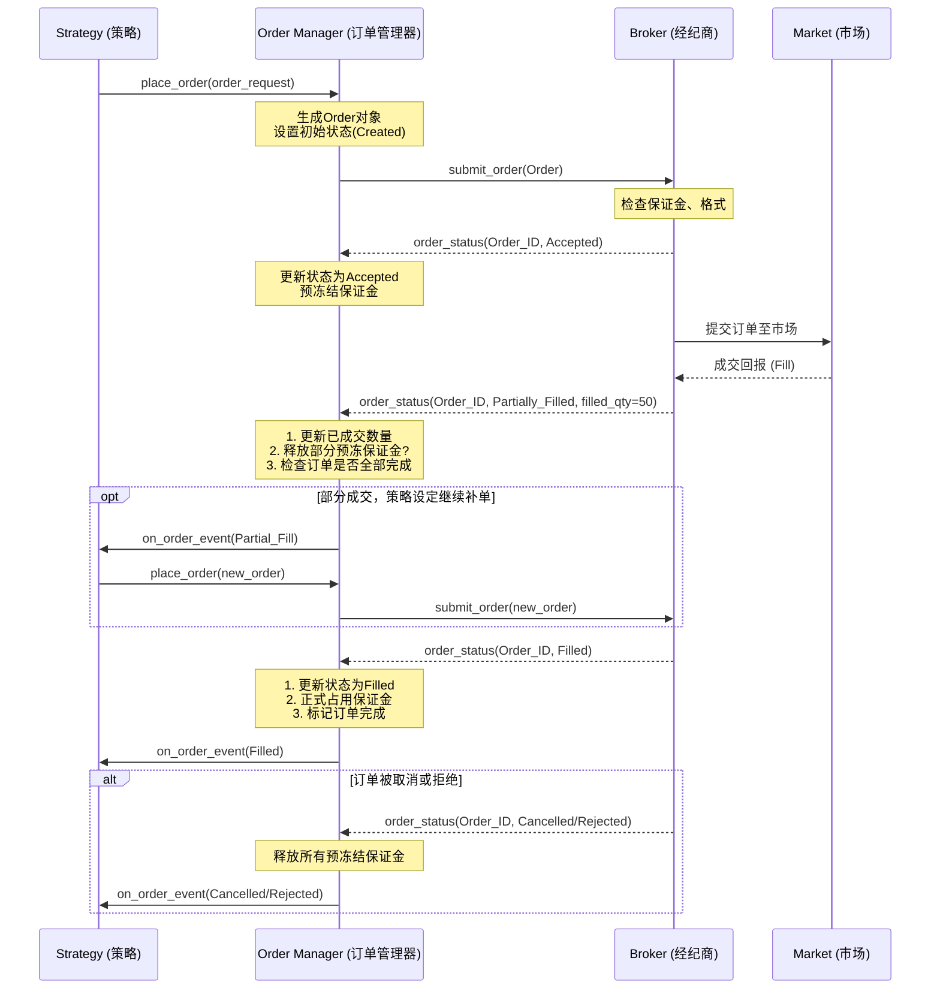

Q: 抱歉，我要说的是order和order列表，我希望我在order列表被broker处理后，能通知到broker进行状态检查或者继续执行未完成的order订单


A: 非常好，这是一个至关重要且专业的设计问题。您需要的不是一个简单的订单列表，而是一个**订单管理器（Order Manager）** 来协同策略（Strategy）和经纪商（Broker），并处理订单的生命周期事件。

核心思想是：**不要被动地等待“检查”，而是建立一个事件驱动的系统，让Broker主动通知，由订单管理器来智能响应。**

下面我将详细解释如何设计这个流程，并提供代码结构建议。

### 核心设计：订单管理器（Order Manager）

`Order Manager` 作为策略和经纪商之间的中间人，负责：
1.  维护所有订单的列表（您的“order列表”）。
2.  将策略的订单请求发送给经纪商。
3.  接收来自经纪商的订单状态更新。
4.  根据状态更新，决定是否需要执行后续操作（如继续执行未完成订单）。

整个流程涉及策略、订单管理器和经纪商之间的协同，其核心交互与事件流如下图所示：



---

### 代码结构示例

以下是实现上述流程的Python伪代码框架：

#### 1. 定义订单类 (Order.py)

```python
class Order:
    def __init__(self, order_id, symbol, side, order_type, quantity, price=None):
        self.order_id = order_id
        self.symbol = symbol
        self.side = side  # 'buy' or 'sell'
        self.type = order_type  # 'market', 'limit'
        self.quantity = quantity
        self.filled_quantity = 0.0  # 已成交数量
        self.price = price
        self.status = "Created"  # 状态: Created, Submitted, Accepted, PartiallyFilled, Filled, Cancelled, Rejected
        self.timestamp = None

    def is_active(self):
        return self.status in ("Submitted", "Accepted", "PartiallyFilled")
    
    def is_done(self):
        return self.status in ("Filled", "Cancelled", "Rejected")
```

#### 2. 定义订单管理器 (OrderManager.py)

这是最核心的部分。

```python
class OrderManager:
    def __init__(self, broker):
        self.open_orders = {}  # 活跃订单字典: order_id -> Order Object
        self.all_orders = []   # 所有订单的历史列表
        self.broker = broker   # 经纪商实例
        # 向经纪商注册回调函数，这样经纪商有任何更新都会通知我们
        self.broker.set_order_status_callback(self.on_order_status_update)

    def place_order(self, order_request):
        """ 接收来自策略的订单请求 """
        # 1. 创建订单对象
        new_order = Order(...)
        new_order.status = "Created"
        self.open_orders[new_order.order_id] = new_order
        self.all_orders.append(new_order)

        # 2. 通过经纪商提交订单
        try:
            self.broker.submit_order(new_order)
            new_order.status = "Submitted"
        except Exception as e:
            new_order.status = "Rejected"
            # 通知策略...
            
    def on_order_status_update(self, order_id, new_status, filled_qty, **kwargs):
        """ 经纪商回调函数：处理订单状态更新 """
        order = self.open_orders.get(order_id)
        if not order:
            return # 找不到订单，记录日志

        old_status = order.status
        order.status = new_status
        order.filled_quantity = filled_qty

        # --- 状态处理逻辑的核心 ---
        if new_status == "PartiallyFilled":
            self._handle_partial_fill(order)
            
        elif new_status == "Filled":
            self._handle_fill(order)
            self._clean_up_order(order) # 从open_orders中移除

        elif new_status == "Cancelled":
            if old_status == "PartiallyFilled":
                self._handle_partial_cancel(order)
            self._clean_up_order(order)

        elif new_status == "Rejected":
            self._clean_up_order(order)

        # 通知策略（或其他组件）状态发生了变化
        self._notify_strategy(order, old_status, new_status)

    def _handle_partial_fill(self, order):
        """ 处理部分成交 """
        # 1. 更新本地持仓和资金计算（释放部分预冻结保证金？）
        # 2. 检查是否需要自动创建新订单来补足剩余数量？
        #    例如：策略希望无论如何都要完全成交，可以在这里触发一个新的限价单/市价单
        remaining_qty = order.quantity - order.filled_quantity
        # if self.strategy.continue_on_partial_fill: # 示例逻辑
        #     new_order_request = ... # 创建新的订单请求，数量为remaining_qty
        #     self.place_order(new_order_request)
        print(f"Order {order.order_id} partially filled. Filled: {order.filled_quantity}, Remaining: {remaining_qty}")

    def _handle_fill(self, order):
        """ 处理完全成交 """
        # 更新投资组合：正式占用保证金，增加持仓
        print(f"Order {order.order_id} fully filled.")

    def _handle_partial_cancel(self, order):
        """ 处理部分成交后的取消 """
        # 处理部分成交后剩下的部分被取消的逻辑
        remaining_qty = order.quantity - order.filled_quantity
        # 释放剩余数量的预冻结保证金
        print(f"Order {order.order_id} partially cancelled. {remaining_qty} units cancelled after partial fill.")

    def _clean_up_order(self, order):
        """ 订单终结处理 """
        if order.is_done():
            self.open_orders.pop(order.order_id, None)

    def _notify_strategy(self, order, old_status, new_status):
        # 这里可以通过回调函数、消息队列、事件总线等方式通知策略
        # 例如：self.strategy.on_order_event(order, old_status, new_status)
        print(f"Order {order.order_id} updated: {old_status} -> {new_status}")
```

#### 3. 经纪商接口 (Broker.py)

```python
class Broker:
    def __init__(self):
        self.order_status_callback = None

    def set_order_status_callback(self, callback_func):
        """ 由OrderManager调用，注册回调函数 """
        self.order_status_callback = callback_func

    def submit_order(self, order):
        """ 提交订单到真实交易所/模拟引擎 """
        # ... 内部逻辑 ...
        # 当有状态变化时（如接受、成交、取消），调用回调函数通知OrderManager
        # 例如：
        self._simulate_order_acceptance(order)

    def _simulate_order_acceptance(self, order):
        # 模拟经纪商接受订单
        if self.order_status_callback:
            # 这里模拟经纪商在另一个线程/事件循环中异步回调
            self.order_status_callback(order.order_id, "Accepted", 0.0)
```

### 总结与优势

1.  **事件驱动（Event-Driven）**：系统不会阻塞等待，而是由Broker的事件通知来驱动。这是高性能交易系统的关键。
2.  **职责清晰**：
    *   `Order`：只负责存储数据。
    *   `OrderManager`：负责订单生命周期管理和逻辑决策（是大脑）。
    *   `Broker`：负责与市场通信（是手脚）。
3.  **灵活性**：在 `_handle_partial_fill` 等方法中，你可以实现任何高级逻辑，比如自动追单、止损移仓、策略紧急停止等。
4.  **状态一致性**：所有状态更新都通过一个中心化的回调函数 `on_order_status_update` 处理，避免了状态不同步的问题。

通过这种设计，您的系统就能高效、可靠地处理订单列表，并在Broker处理后进行正确的状态检查和后续操作。


Q：在我配制订单和接收订单时，如何保证订单的顺序，有没有什么办法

A：保证订单的顺序是量化交易系统设计中一个非常关键且具有挑战性的问题。订单处理的顺序主要涉及两个方面：**1. 提交顺序** 和 **2. 回报顺序**。

下面我将详细解释挑战所在，并提供几种不同可靠性级别的解决方案。

### 核心挑战：为什么顺序会乱？

1.  **异步处理**：现代系统为了性能，普遍采用异步I/O、多线程或事件循环。这意味着你调用 `broker.submit(order_A)` 和 `broker.submit(order_B)` 虽然是顺序的，但它们可能被放入不同的线程或网络栈中处理，**订单B的网络包有可能比订单A先到达交易所**。
2.  **网络延迟与抖动**：不同的网络路径、交易所网关的负载都可能导致数据包到达顺序与发送顺序不一致。
3.  **交易所处理逻辑**：即使订单按顺序到达交易所，交易所内部的撮合引擎也可能因订单类型、价格等因素而以不同的速度处理它们。
4.  **回报通道独立**：订单提交和状态回报通常是不同的网络连接。你可能会先收到订单B的“已接受”回报，然后才收到订单A的回报。

---

为了保证订单的提交与回报顺序，您的系统需要一个包含订单ID生成器、订单管理器、串行执行器和回调处理器的协同处理流程，其核心架构与数据流如下图所示：

```mermaid
flowchart TD
    subgraph Strategy[策略线程]
        S[策略逻辑]
    end

    S -- 生成原始订单请求 --> OM[订单管理器]

    subgraph OrderManager[订单管理器 (单线程事件循环)]
        direction TB
        IDGen[订单ID生成器<br>（单调递增）]
        OM_Core[核心逻辑]
        Executor[串行执行器]
        CallbackProcessor[回调处理器]

        IDGen -- 分配唯一ID --> OM_Core
        OM_Core -- 放入提交队列 --> Executor
        Executor -- 顺序提交 --> Broker
        CallbackProcessor -- 更新状态&顺序回调 --> OM_Core
    end

    Broker[经纪商 Broker]
    Market[交易所]

    Broker -- 异步回报（状态更新） --> CallbackProcessor
    Broker -- 提交订单 --> Market

```

下面我们对图中的关键组件和流程进行详细说明。

### 解决方案：从简单到健壮

#### 级别一：基础保证（适用于低频、非关键交易）

这种方法在应用层进行简单控制。

1.  **同步提交**：
    *   **做法**：提交订单A后，阻塞（等待）直到收到它的状态回报（如 `Accepted`），然后再提交订单B。
    *   **优点**：实现简单，能保证提交和回报的顺序性。
    *   **缺点**：性能极差，延迟非常高，完全无法用于任何高频或准高频策略。

2.  **本地序列号（Local Sequence Number）**：
    *   **做法**：为每个订单在生成时分配一个本地单调递增的ID（例如 `1, 2, 3, ...`）。
    ```python
    class OrderManager:
        def __init__(self):
            self._next_order_id = 1 # 初始序列号
            self.pending_orders = {} # 用于存储已发送未回报的订单

        def place_order(self, order_request):
            new_order = Order(id=self._next_order_id, ...)
            self._next_order_id += 1 # 序列号递增

            self.pending_orders[new_order.id] = new_order
            self.broker.submit_order(new_order)
    ```
    *   **作用**：这样即使回报顺序乱了，你也可以通过这个本地ID知道订单的**原始创建顺序**，从而在逻辑上进行后续处理。

#### 级别二：高级保证（推荐，适用于大多数策略）

这是最常用且有效的模式，结合了异步和高可靠性。

1.  **串行执行器（Serialized Executor）**：
    *   **核心思想**：**用一个单线程循环或队列来处理所有订单提交和回报处理**。这是最关键的一点。
    *   **做法**：
        *   创建一个专门的 `order_queue`。
        *   策略线程想发单时，不直接调用Broker，而是将订单请求放入这个队列。
        *   有一个单独的 `OrderManagementThread`（单线程）从队列中取出订单，**一个一个地**调用 `broker.submit_order()`。
        *   同样，所有从Broker回来的回报（如 `on_order_status` 回调），也先放入一个 `event_queue`。
        *   同一个管理线程也负责从这个 `event_queue` 中取出事件，**一个一个地**处理状态更新。
    *   **优点**：通过“单线程”这个天然锁，确保了提交和回报处理的顺序性。既保证了顺序，又保持了异步架构的高性能。

    ```python
    # 伪代码示例
    import queue
    import threading

    class OrderManager:
        def __init__(self, broker):
            self.broker = broker
            self.order_queue = queue.Queue()
            self.event_queue = queue.Queue()
            self.broker.set_callback(self.on_broker_event) # Broker回调也写入事件队列
            self._management_thread = threading.Thread(target=self._run_loop, daemon=True)
            self._management_thread.start()

        def place_order(self, order_req):
            # 策略线程调用此方法，是非阻塞的
            self.order_queue.put(('SUBMIT', order_req))

        def on_broker_event(self, event):
            # Broker的回调通常在其自己的线程中，将事件放入队列
            self.event_queue.put(('EVENT', event))

        def _run_loop(self):
            # 单线程管理循环，保证顺序
            while True:
                # 优先处理回报事件，因为它们可能影响状态
                try:
                    event_type, data = self.event_queue.get_nowait()
                    if event_type == 'EVENT':
                        self._process_event(data)
                except queue.Empty:
                    pass

                # 然后处理新的订单提交
                try:
                    event_type, data = self.order_queue.get_nowait()
                    if event_type == 'SUBMIT':
                        self._submit_order(data)
                except queue.Empty:
                    pass

                time.sleep(0.001) # 短暂休眠避免CPU空转

        def _submit_order(self, order_req):
            # 这个函数在同一管理线程内顺序执行
            order = self._create_order(order_req)
            self.broker.submit_order(order) # 这里是同步还是异步取决于Broker实现

        def _process_event(self, event):
            # 在同一管理线程内顺序处理事件
            order_id = event.order_id
            # ... 更新订单状态 ...
            # ... 通知策略 ...
    ```

#### 级别三：极端保证（适用于超低延迟或交易所要求）

1.  **使用交易所提供的唯一标识符**：
    *   **做法**：许多交易所API在你提交订单后，会立刻返回一个唯一的 `Exchange_Order_ID` 或 `Request_ID`。你可以用这个ID来唯一标识订单，而不是依赖本地ID。这对于防止因网络重复发包导致的重复订单至关重要。

2.  **序列号恢复（Sequence Number Recovery）**：
    *   **做法**：在连接交易所的会话层，使用序列号来检测丢包和乱序。这是FIX协议等专业金融协议的标准功能。如果你的Broker库支持，应该启用它。它可以保证网络层面的消息顺序。

### 总结与建议

| 方法 | 优点 | 缺点 | 适用场景 |
| :--- | :--- | :--- | :--- |
| **同步提交** | 简单 | 性能极差 | 初学者、低频策略 |
| **本地序列号** | 实现简单，无性能损耗 | 只能知道原始顺序，无法控制执行顺序 | 所有场景的基础必备项 |
| **串行执行器** | 性能好，可靠性高，顺序有保证 | 架构稍复杂 | **绝大多数专业量化系统的选择** |
| **交易所ID/序列号恢复** | 极可靠，符合行业标准 | 实现复杂，依赖交易所API | 超低延迟交易、机构级系统 |

**给你的最终建议：**

1.  **务必使用本地单调递增的订单ID**。这是最基本的保障。
2.  **强烈建议实现“串行执行器”模式**。即使用一个单线程事件循环来管理所有订单提交和状态回报处理。这是保证顺序性和一致性的最佳实践，且能保持良好的性能。
3.  在选择Broker API时，了解它是否提供`Request_ID`或`Exchange_Order_ID`，并在你的订单管理中关联这些ID。
4.  在你的订单管理器中，记录详细的日志（包括本地ID、交易所ID、时间戳），这样当出现任何顺序问题时，你可以有数据可供排查。

通过结合 **本地序列号** 和 **串行执行器**，你可以构建一个既高效又能保证订单处理顺序的可靠系统。


